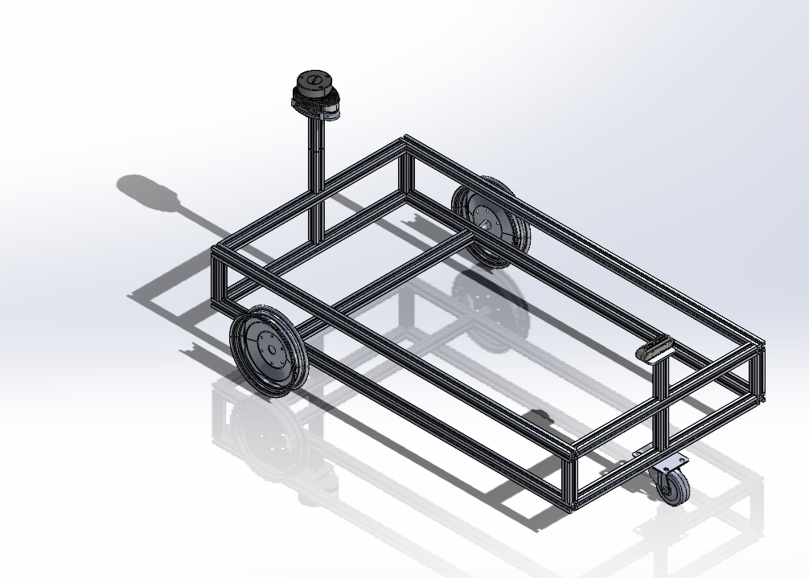
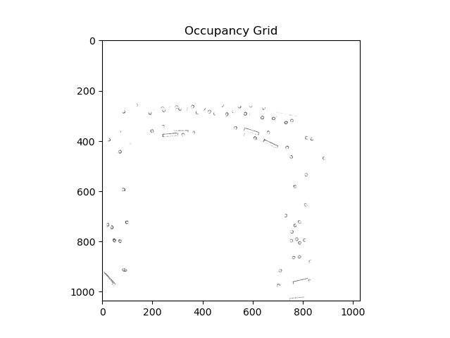

# IITISoC-24-IVR4-Motion-Planning-with-Controls-for-Self-Driving-Vehicles

## Goal:
To develop a reliable Motion Planner with Control algorithms for collision-free path planning and efficient navigation in a simulated environment.

People Involved : 

Mentors:
- [Arjun S Nair](https://github.com/arjun-593)
- [Ampady B R](https://github.com/ampady06)

Members:
- [Prathamesh Kawtikwar](https://github.com/ppk1709)
- [S Sri Vaishnavi](https://github.com/vaishnavi-1035)
- [Vashista Boddula](https://github.com/Vashista2412)
- [Sanaga Sai Varshini](https://github.com/varshini2902)
- [Sameer Lakkad](https://github.com/sameerlakkad)
 
-

## Implementation:
As an input we were given a world file for the project which looks like this in gazebo

For the above project, we modelled our own 3-wheeled vehicle

Our first task was to get the map of the above world through SLAM.
For SLAM, we conducted many tests with different robots like:
1. Turtlebot3
2. Atomatic Addison bot

We conducted SLAM with the following two packages
1. Cartographer(for turtlebot3)
2. SLAM toolbox(For the addison bot)

We got better results with latter, and the map after looked like this(we only mapped the lane in which the robot has to navigate through)

After getting a fairly accurate map, we moved onto trying path planning algorithms like 
1. RRT
2. Astar
3. RRTstar

First we converted our map to a binary occupancy grid given below to make path planning feasible

Here's a one with Astar:

In the next phase, we'll be starting with implemention of Control algorithms like MPC(Model Predictive Control.

